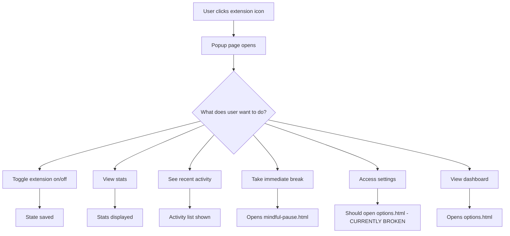

# Popup Page Elements and User Interactions

## Overview

The popup page is the main interface users see when they click on the Mindful Browsing extension icon in their browser toolbar. It provides quick access to extension features and information.

## Element Analysis

### 1. Header Section

#### Logo/Brand Area

- **Element**: Leaf icon with "Mindful Browsing" text
- **What is happening**:
  - Displays the extension brand and name
  - Provides visual identity with the leaf icon
- **What could happen**:
  - Could link to the extension's website or documentation
  - Could show an "about" modal with version information

#### Settings Button (Gear Wheel Icon)

- **Element**: Settings icon from lucide-react library
- **What is happening**:
  - Currently non-functional (no click handler)
  - Visually present but does nothing when clicked
- **What should happen**:
  - Should open the options page for extension configuration
- **What could happen**:
  - Could open options in a popup window instead of new tab
  - Could show a tooltip explaining its function
  - Could have animation on hover

### 2. Extension Status Toggle

#### Toggle Switch

- **Element**: Switch component with status indicator
- **What is happening**:
  - Shows current enabled/disabled state with a colored dot
  - Allows user to toggle the extension on/off
  - Saves state via chrome.runtime.sendMessage
- **What could happen**:
  - Could provide visual feedback when state is saved (e.g., checkmark animation)
  - Could show loading state during save operation
  - Could show confirmation message
  - Could have keyboard shortcut support

### 3. Today's Stats Section

#### Statistics Display

- **Element**: Three counters showing pauses, mindful choices, and breaks
- **What is happening**:
  - Displays today's mindfulness statistics
  - Uses colored counters for different metrics (blue for pauses, green for continues, purple for breaks)
- **What could happen**:
  - Could link to detailed statistics page
  - Could show historical data trends with mini charts
  - Could show comparison to previous days/weeks
  - Could have tooltips explaining each metric

### 4. Recent Activity Section

#### Activity List

- **Element**: List showing last 3 activities with sites and actions
- **What is happening**:
  - Displays recent mindful browsing activities
  - Shows time ago for each activity (e.g., "5 mins ago")
- **What could happen**:
  - Could expand to show more activities with a "show more" button
  - Could link to full activity log
  - Could allow filtering by activity type
  - Could show site favicons for better visual recognition

### 5. Quick Actions Section

#### "Take a mindful break now" Button

- **Element**: Button with heart icon
- **What is happening**:
  - Opens mindful-pause.html in a new tab
- **What could happen**:
  - Could show confirmation or progress indicator
  - Could have a countdown timer for next available break
  - Could customize the type of break offered

#### "View full dashboard" Button

- **Element**: Button with sparkles icon
- **What is happening**:
  - Opens options.html in a new tab
- **What could happen**:
  - Could be renamed to "Settings" or "Options" for clarity
  - Could show a badge with number of available settings
  - Could have a different icon that better represents settings/options

### 6. Footer Section

#### Inspirational Text

- **Element**: "Breathe. Reflect. Choose mindfully." text
- **What is happening**:
  - Static text providing mindfulness encouragement
- **What could happen**:
  - Could rotate different mindfulness quotes
  - Could be personalized based on user preferences
  - Could link to mindfulness resources

## User Interaction Flow



## Issues and Improvements

### Current Issues

1. **Settings button non-functional**: The gear wheel icon doesn't open the options page
2. **Naming inconsistency**: "View full dashboard" button opens options, but there's also a non-functional settings button

### Suggested Improvements

1. **Fix settings button**: Add onClick handler to open options.html
2. **Improve labeling**: Rename "View full dashboard" to "Settings" or "Options" for clarity
3. **Add visual feedback**: Show loading states, success messages, and animations
4. **Enhance accessibility**: Add proper ARIA labels and keyboard navigation
5. **Add tooltips**: Provide explanations for all interactive elements

## Technical Implementation Notes

### Opening Pages

The extension uses `chrome.tabs.create()` with `chrome.runtime.getURL()` to open pages:

```javascript
chrome.tabs.create({
  url: chrome.runtime.getURL("options.html"),
});
```

### State Management

Extension state is managed through `chrome.runtime.sendMessage()` with actions like:

- "getInitialData" - to load data when popup opens
- "saveState" - to save extension settings

### Data Display

- Statistics are calculated based on today's date
- Activity times are formatted as "time ago" strings
- Recent activities are limited to the last 3 entries
